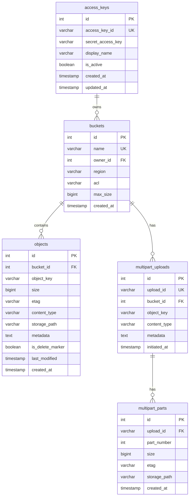

# 📦 S3-Compatible Storage Server

A self-hosted, AWS S3-compatible object storage server built with **Bun**, **Elysia.js**, and **MySQL**. Comes with a modern React-based admin dashboard for managing buckets, objects, and access keys.

---

## ✨ Features

- **S3-Compatible API** — Supports standard S3 operations: `PutObject`, `GetObject`, `DeleteObject`, `CopyObject`, `ListObjectsV2`, `CreateBucket`, `DeleteBucket`, `HeadObject`, `HeadBucket`, and more.
- **Multipart Upload** — Full support for large file uploads via `CreateMultipartUpload`, `UploadPart`, `CompleteMultipartUpload`, `AbortMultipartUpload`, and `ListParts`.
- **AWS Signature V4 & V2** — Full authentication using AWS Signature V4 (header & presigned URL) and V2 presigned URL.
- **Bucket ACL** — Bucket-level access control: `private` (default) and `public-read`.
- **Storage Quotas** — Per-bucket size limits (unlimited, 1GB–10TB).
- **Range Requests** — HTTP Range header support for streaming and partial downloads.
- **Admin Dashboard** — Modern web interface for complete storage management.
- **Security Hardened** — Constant-time signature comparison, path traversal protection, login rate limiting, and CORS restriction.

---

## 🛠 Tech Stack

| Component | Technology |
|-----------|-----------|
| **Runtime** | [Bun](https://bun.sh) |
| **Backend Framework** | [Elysia.js](https://elysiajs.com) |
| **Database** | MySQL + [Drizzle ORM](https://orm.drizzle.team) |
| **Storage** | Local filesystem |
| **Dashboard** | React 19 + Vite + React Router |
| **Auth** | AWS Signature V4/V2 (S3), JWT (Admin) |

---

## 📁 Project Structure

```
s3-compatible/
├── src/
│   ├── config/
│   │   └── env.ts              # Environment variable configuration
│   ├── db/
│   │   ├── connection.ts       # MySQL connection pool (Drizzle)
│   │   └── schema.ts           # Database schema (5 tables)
│   ├── lib/
│   │   ├── auth/
│   │   │   └── signature-v4.ts # AWS Signature V4/V2 verification
│   │   ├── errors.ts           # S3 error definitions
│   │   ├── storage/
│   │   │   └── filesystem.ts   # Filesystem storage adapter
│   │   └── xml/
│   │       └── builder.ts      # XML response builder
│   ├── middleware/
│   │   ├── admin-auth.ts       # Admin JWT auth middleware
│   │   └── s3-auth.ts          # S3 Signature auth middleware
│   ├── routes/
│   │   ├── admin/
│   │   │   ├── auth.ts         # Admin login/verify (rate limited)
│   │   │   ├── buckets.ts      # Bucket management API
│   │   │   ├── keys.ts         # Access key management API
│   │   │   └── stats.ts        # Dashboard statistics API
│   │   └── s3/
│   │       ├── bucket.ts       # S3 bucket operations
│   │       ├── multipart.ts    # Multipart upload operations
│   │       └── object.ts       # S3 object operations
│   └── index.ts                # Entry point
├── dashboard/                  # Admin Dashboard (React)
│   ├── src/
│   │   ├── components/
│   │   │   └── ConfirmDialog.tsx
│   │   ├── lib/
│   │   │   ├── api.ts          # API client (Axios)
│   │   │   └── auth.tsx        # Auth context & provider
│   │   └── pages/
│   │       ├── LoginPage.tsx
│   │       ├── DashboardPage.tsx
│   │       ├── BucketsPage.tsx
│   │       ├── ObjectBrowserPage.tsx
│   │       └── KeysPage.tsx
│   └── .env.sample
├── storage/                    # Object storage directory
├── drizzle.config.ts           # Drizzle Kit configuration
├── .env.sample                 # Environment template
└── package.json
```

---

## 🚀 Quick Start

### Prerequisites

- [Bun](https://bun.sh) v1.0+
- MySQL 8.0+
- Node.js 18+ (for dashboard)

### 1. Clone & Install

```bash
git clone <repo-url>
cd s3-compatible

# Install backend dependencies
bun install

# Install dashboard dependencies
cd dashboard && bun install && cd ..
```

### 2. Configure Environment

```bash
# Backend
cp .env.sample .env
# Edit .env with your database credentials, admin password, and JWT secret

# Dashboard
cp dashboard/.env.sample dashboard/.env
```

### 3. Setup Database

```bash
# Push schema to MySQL
bun run db:push
```

### 4. Start the Server

```bash
# Terminal 1 — Backend (port 3000)
bun run dev

# Terminal 2 — Dashboard (port 5173)
cd dashboard && bun run dev
```

The server will be available at:
- **S3 API**: `http://localhost:3000`
- **Admin Dashboard**: `http://localhost:5173`
- **Admin API**: `http://localhost:3000/admin`

---

## ⚙️ Environment Variables

### Backend (`.env`)

| Variable | Default | Description |
|----------|---------|-------------|
| `PORT` | `3000` | Server port |
| `HOST` | `0.0.0.0` | Bind address |
| `DB_HOST` | `127.0.0.1` | MySQL host |
| `DB_PORT` | `3306` | MySQL port |
| `DB_USER` | `root` | MySQL user |
| `DB_PASSWORD` | *(empty)* | MySQL password |
| `DB_NAME` | `s3` | MySQL database name |
| `STORAGE_PATH` | `./storage` | Directory for stored objects |
| `ADMIN_USERNAME` | `admin` | Admin dashboard username |
| `ADMIN_PASSWORD` | `admin123` | Admin dashboard password |
| `JWT_SECRET` | `change-this-...` | Secret for admin JWT tokens |
| `S3_REGION` | `us-east-1` | Default S3 region |
| `CORS_ORIGIN` | `http://localhost:5173` | Allowed CORS origins (comma-separated) |

### Dashboard (`dashboard/.env`)

| Variable | Default | Description |
|----------|---------|-------------|
| `VITE_API_URL` | `http://localhost:3000` | Backend API URL |

---

## 🗄 Database Schema



---

## 📡 S3 API Reference

All S3 endpoints require AWS Signature V4 authentication or presigned URLs, except GET/HEAD operations on `public-read` buckets.

### Bucket Operations

| Method | Endpoint | Operation | Description |
|--------|----------|-----------|-------------|
| `GET` | `/` | ListBuckets | List all buckets |
| `PUT` | `/:bucket` | CreateBucket | Create a new bucket |
| `HEAD` | `/:bucket` | HeadBucket | Check if bucket exists |
| `DELETE` | `/:bucket` | DeleteBucket | Delete bucket (must be empty) |
| `GET` | `/:bucket` | ListObjectsV2 | List objects in bucket |
| `GET` | `/:bucket?location` | GetBucketLocation | Get bucket region |
| `GET` | `/:bucket?versioning` | GetBucketVersioning | Get versioning status |
| `GET` | `/:bucket?acl` | GetBucketAcl | Get bucket ACL |
| `PUT` | `/:bucket?acl` | PutBucketAcl | Set bucket ACL |

**ListObjectsV2 Query Parameters:**
- `prefix` — Filter by key prefix
- `delimiter` — Delimiter for grouping (usually `/`)
- `max-keys` — Max objects per page (default: 1000)
- `continuation-token` — Pagination token

### Object Operations

| Method | Endpoint | Operation | Description |
|--------|----------|-----------|-------------|
| `PUT` | `/:bucket/*` | PutObject | Upload an object |
| `GET` | `/:bucket/*` | GetObject | Download an object |
| `HEAD` | `/:bucket/*` | HeadObject | Get object metadata |
| `DELETE` | `/:bucket/*` | DeleteObject | Delete an object |
| `POST` | `/:bucket?delete` | DeleteObjects | Batch delete objects (XML) |
| `PUT` | `/:bucket/*` | CopyObject | Copy object (with `x-amz-copy-source` header) |

### Multipart Upload Operations

| Method | Endpoint | Operation | Description |
|--------|----------|-----------|-------------|
| `POST` | `/:bucket/*?uploads` | CreateMultipartUpload | Initiate multipart upload |
| `PUT` | `/:bucket/*?uploadId=X&partNumber=N` | UploadPart | Upload a single part |
| `POST` | `/:bucket/*?uploadId=X` | CompleteMultipartUpload | Complete the upload |
| `DELETE` | `/:bucket/*?uploadId=X` | AbortMultipartUpload | Abort the upload |
| `GET` | `/:bucket/*?uploadId=X` | ListParts | List uploaded parts |

---

## 🔑 Admin API Reference

All admin endpoints require `Authorization: Bearer <token>` header (except `/login`).

### Authentication

| Method | Endpoint | Description |
|--------|----------|-------------|
| `POST` | `/admin/auth/login` | Login (rate limited: 5 attempts / 15 min) |
| `POST` | `/admin/auth/verify` | Verify token validity |

**Login Request:**
```json
{ "username": "admin", "password": "admin123" }
```

**Login Response:**
```json
{ "token": "eyJ...", "expiresIn": 86400 }
```

### Access Keys

| Method | Endpoint | Description |
|--------|----------|-------------|
| `GET` | `/admin/keys` | List all access keys |
| `POST` | `/admin/keys` | Create a new access key |
| `DELETE` | `/admin/keys/:id` | Delete an access key |
| `PATCH` | `/admin/keys/:id/toggle` | Enable/disable a key |

### Buckets

| Method | Endpoint | Description |
|--------|----------|-------------|
| `GET` | `/admin/buckets` | List all buckets with stats |
| `GET` | `/admin/buckets/:bucket` | Get single bucket details |
| `POST` | `/admin/buckets` | Create a new bucket |
| `PATCH` | `/admin/buckets/:bucket` | Update ACL / quota |
| `DELETE` | `/admin/buckets/:bucket` | Delete bucket and all objects |
| `GET` | `/admin/buckets/:bucket/objects` | List objects (paginated) |
| `DELETE` | `/admin/buckets/:bucket/objects/*` | Delete a specific object |

### Statistics

| Method | Endpoint | Description |
|--------|----------|-------------|
| `GET` | `/admin/stats` | Overview (bucket count, object count, storage used, recent uploads) |

---

## 🖥 Admin Dashboard

The dashboard provides a web interface for:

- **Dashboard** — Statistics overview (total buckets, objects, storage, recent uploads)
- **Buckets** — Create/view buckets, set quota on creation
- **Object Browser** — Browse files/folders with a tabbed interface:
  - **File Manager** — Upload, download, delete objects, folder navigation
  - **Settings** — Toggle ACL, change storage quota, delete bucket (Danger Zone)
- **Access Keys** — Create/delete/toggle access keys for S3 API

---

## 🔗 S3 Client Integration

### AWS CLI

```bash
aws configure
# AWS Access Key ID: <from dashboard>
# AWS Secret Access Key: <from dashboard>
# Default region name: us-east-1
# Default output format: json

# Use --endpoint-url for every command
aws s3 ls --endpoint-url http://localhost:3000
aws s3 cp file.txt s3://my-bucket/ --endpoint-url http://localhost:3000
aws s3 rm s3://my-bucket/file.txt --endpoint-url http://localhost:3000
```

### AWS SDK (JavaScript)

```typescript
import { S3Client, PutObjectCommand, GetObjectCommand } from '@aws-sdk/client-s3';

const s3 = new S3Client({
    region: 'us-east-1',
    endpoint: 'http://localhost:3000',
    credentials: {
        accessKeyId: 'YOUR_ACCESS_KEY',
        secretAccessKey: 'YOUR_SECRET_KEY',
    },
    forcePathStyle: true, // Required for S3-compatible servers
});

// Upload
await s3.send(new PutObjectCommand({
    Bucket: 'my-bucket',
    Key: 'hello.txt',
    Body: 'Hello World!',
}));

// Download
const response = await s3.send(new GetObjectCommand({
    Bucket: 'my-bucket',
    Key: 'hello.txt',
}));
```

### Python (Boto3)

```python
import boto3

s3 = boto3.client('s3',
    endpoint_url='http://localhost:3000',
    aws_access_key_id='YOUR_ACCESS_KEY',
    aws_secret_access_key='YOUR_SECRET_KEY',
    region_name='us-east-1',
)

# Upload
s3.put_object(Bucket='my-bucket', Key='hello.txt', Body=b'Hello World!')

# List
response = s3.list_objects_v2(Bucket='my-bucket')
for obj in response.get('Contents', []):
    print(obj['Key'], obj['Size'])
```

### S3 Browser / Cyberduck

Use the following settings:
- **Server**: `localhost`
- **Port**: `3000`
- **Access Key ID**: *(from dashboard)*
- **Secret Access Key**: *(from dashboard)*
- **Protocol**: HTTP (not HTTPS for local dev)
- **Path Style**: Enable / Force Path Style

---

## 🔐 Security

| Feature | Description |
|---------|-------------|
| **AWS Signature V4** | HMAC-SHA256 verification on every request |
| **Presigned URLs** | V4 & V2 support with expiry validation |
| **Constant-time Compare** | `timingSafeEqual` for all signature comparisons |
| **Path Traversal Protection** | Resolved path validation within storage directory |
| **Rate Limiting** | Max 5 login attempts per IP per 15 minutes |
| **CORS Restriction** | Origin whitelist via `CORS_ORIGIN` env variable |
| **JWT Admin Tokens** | 24-hour tokens with nonce and expiry validation |

---

## 🚀 Production Deployment

### 1. Set Environment Variables

```bash
# Must be changed in production!
ADMIN_PASSWORD=your-strong-password
JWT_SECRET=$(openssl rand -hex 32)
CORS_ORIGIN=https://admin.yourdomain.com
```

### 2. Build Dashboard

```bash
cd dashboard
echo "VITE_API_URL=https://s3.yourdomain.com" > .env.production
npm run build
# Output: dashboard/dist/
```

### 3. Start Server

```bash
bun run start
```

### 4. Reverse Proxy (Nginx)

```nginx
server {
    listen 443 ssl;
    server_name s3.yourdomain.com;

    # S3 API
    location / {
        proxy_pass http://127.0.0.1:3000;
        proxy_set_header Host $host;
        proxy_set_header X-Real-IP $remote_addr;
        proxy_set_header X-Forwarded-For $proxy_add_x_forwarded_for;
        client_max_body_size 10G;
    }
}

server {
    listen 443 ssl;
    server_name admin.yourdomain.com;

    # Dashboard static files
    root /path/to/dashboard/dist;
    index index.html;

    location / {
        try_files $uri $uri/ /index.html;
    }
}
```

---

## 📜 Available Scripts

| Script | Description |
|--------|-------------|
| `bun run dev` | Start server with hot-reload |
| `bun run start` | Start production server |
| `bun run db:generate` | Generate Drizzle migrations |
| `bun run db:push` | Push schema to database |
| `bun run db:studio` | Open Drizzle Studio (DB GUI) |

---

## 🤝 Contributing

Please read [CONTRIBUTING.md](CONTRIBUTING.md) before submitting pull requests.

## 📋 Code of Conduct

This project follows the [Contributor Covenant Code of Conduct](CODE_OF_CONDUCT.md).

## 📄 License

MIT
